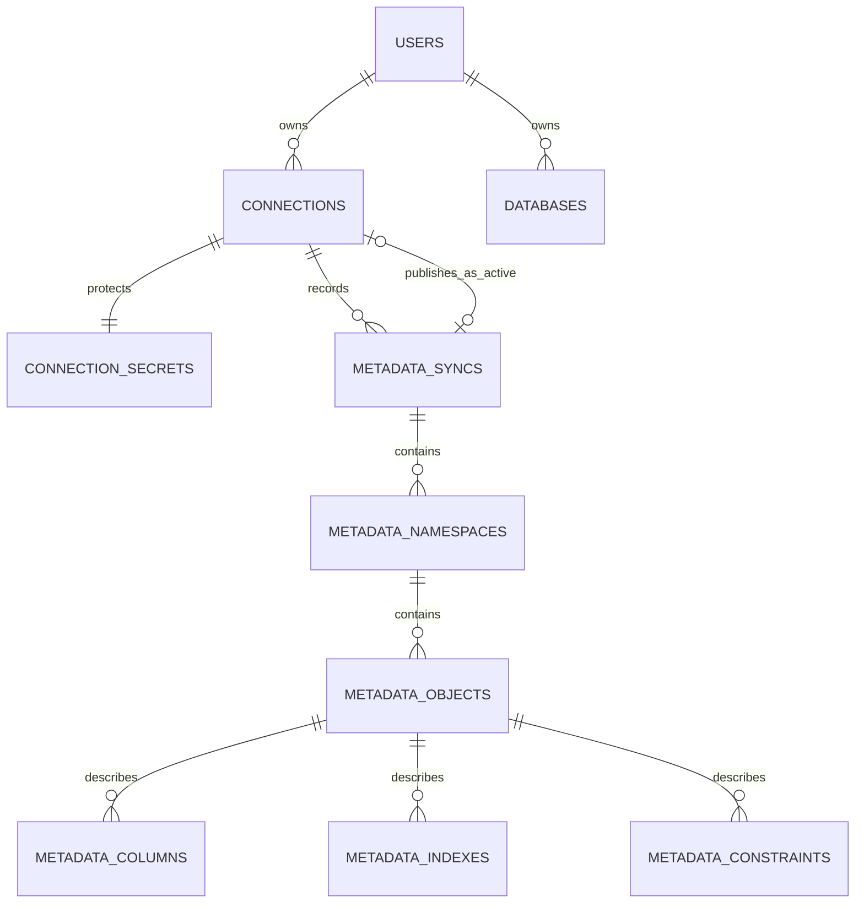

# Модель служебной БД

Служебный PostgreSQL — контейнер `db`, база `verdant`. Она хранит не строки подключённых
систем, а учётные записи DatabaseEnjoyer, параметры подключений и снимки их структуры.
Имя базы сохранено от первой версии, чтобы не ломать существующий Docker volume.

Схема создаётся SQL-миграциями без ORM: `001-metadata.sql` добавляет старые JSON-снимки,
`002-mongodb-engine.sql` — MongoDB для снимков, `003-connections.sql` — профили и каталог,
`004-email-auth.sql` — пользователей и вход по email.

## Карта связей

Каталог — версия структуры одной внешней БД: схемы, таблицы, представления, коллекции,
колонки, индексы и ограничения. У подключения может быть много версий, но интерфейс читает
только версию из `connections.active_sync_id`.

- Профиль и пароль разделены: параметры доступны для списка и редактирования, пароль — только
  для сетевого соединения.
- Каталог версионируется: новая синхронизация не портит последнюю рабочую структуру.
- Реляционные свойства лежат в отдельных колонках; JSONB `extra` хранит только различия СУБД.
- Новые данные принадлежат одному пользователю. Старые записи с `owner_id IS NULL` — переходное
  состояние миграции авторизации.
- Все предметные дочерние связи используют `ON DELETE CASCADE`: удаление профиля очищает только
  локальный пароль и метаданные, но никогда не изменяет подключённую БД.

## Авторизация

### `users`

Одна строка — один пользователь DatabaseEnjoyer. Пароля здесь нет: вход строится на одноразовом
коде из email.

| Поле            | Тип и ограничение                | Для чего нужно                                                                                                                                               |
| --------------- | -------------------------------- | ------------------------------------------------------------------------------------------------------------------------------------------------------------ |
| `id`            | `uuid`, PK, `gen_random_uuid()`  | Неизменяемый идентификатор владельца. На него ссылаются `connections.owner_id` и `databases.owner_id`, поэтому email можно изменить без перепривязки данных. |
| `email`         | `varchar(320)`, NOT NULL, UNIQUE | Адрес для OTP и естественный идентификатор пользователя. Check требует `lower(btrim(email))`, поэтому `A@x.ru` и `a@x.ru` не станут разными аккаунтами.      |
| `created_at`    | `timestamptz`, NOT NULL          | Момент создания аккаунта, полезный для аудита.                                                                                                               |
| `last_login_at` | `timestamptz`, NOT NULL          | Время последнего успешного подтверждения кода; обновляется при входе.                                                                                        |

**Связи.** Один пользователь владеет многими `connections` и многими `databases`.
Обе FK имеют `ON DELETE CASCADE`, поэтому после удаления аккаунта не остаются ничьи профили.

### `auth_email_codes`

Временное состояние passwordless-входа. На нормализованный email существует максимум одна
строка; повторная отправка заменяет старый код.

| Поле          | Тип и ограничение                | Для чего нужно                                                                                                                    |
| ------------- | -------------------------------- | --------------------------------------------------------------------------------------------------------------------------------- |
| `email`       | `varchar(320)`, PK               | Адрес запроса. Он выбран ключом, потому что одновременно нужен один код на email. Та же нормализация, что у `users`.              |
| `code_digest` | `bytea`, NOT NULL                | SHA-256 от email, OTP и `AUTH_OTP_PEPPER`. Открытый код не хранится: дамп служебной БД не позволит использовать письмо для входа. |
| `attempts`    | `smallint`, `0…5`                | Число неверных проверок. Защищает короткий OTP от перебора.                                                                       |
| `sent_at`     | `timestamptz`, NOT NULL          | Когда код выдан; нужен для аудита и ограничения частоты отправки.                                                                 |
| `expires_at`  | `timestamptz`, NOT NULL, indexed | Время истечения (сейчас десять минут); индекс ускоряет поиск и очистку просроченных кодов.                                        |

После успешной проверки строка удаляется. FK на `users` нет, потому что код может запрашивать
ещё не зарегистрированный email; пользователь создаётся после успешного подтверждения.

## Подключение и секрет

### `connections`

Карточка подключения из рабочего пространства. В ней находятся все несекретные данные,
необходимые драйверу для выбора БД и установки сети.

| Поле              | Тип и ограничение                    | Для чего нужно                                                                                                                                                      |
| ----------------- | ------------------------------------ | ------------------------------------------------------------------------------------------------------------------------------------------------------------------- |
| `id`              | `uuid`, PK                           | Идентификатор профиля в REST API, корень дерева каталога и AAD для шифрования секрета.                                                                              |
| `owner_id`        | `uuid`, FK → `users.id`, nullable    | Владелец профиля. Новые записи всегда заполнены; `NULL` возможен только у данных до авторизации. Индекс `(owner_id, created_at DESC)` ускоряет список пользователя. |
| `name`            | `varchar(120)`, NOT NULL             | Человекочитаемая подпись, например «Production analytics». Это не обязательно реальное имя БД.                                                                      |
| `engine`          | `varchar(20)`, CHECK                 | Поддерживаемый драйвер: `postgresql`, `mysql` или `mongodb`. Check не позволяет сохранить неподдерживаемый тип.                                                     |
| `host`            | `varchar(253)`, NOT NULL             | DNS-имя или IP, доступный **из server**, а не обязательно из браузера. Лимит соответствует DNS-имени.                                                               |
| `port`            | `integer`, `1…65535`                 | TCP-порт внешней СУБД. Ограничение отсекает ошибочные значения до сети.                                                                                             |
| `database_name`   | `varchar(120)`, NOT NULL             | Исследуемая PostgreSQL/MySQL/MongoDB database.                                                                                                                      |
| `username`        | `varchar(120)`, NOT NULL             | Пользователь внешней СУБД. Это не пароль, но API возвращает его только владельцу профиля.                                                                           |
| `auth_database`   | `varchar(120)`, nullable             | MongoDB `authSource`; нужен, когда пользователь создан не в `database_name`. Для PostgreSQL/MySQL обычно `NULL`.                                                    |
| `tls`             | `boolean`, NOT NULL, default `false` | Включает TLS с проверкой сертификата в драйвере. Для локальных учебных контейнеров `false`, для production обычно `true`.                                           |
| `description`     | `varchar(2000)`, NOT NULL            | Заметка владельца о роли, окружении или правилах доступа. Пустая строка упрощает клиент по сравнению с `NULL`.                                                      |
| `active_sync_id`  | `uuid`, nullable                     | Последняя опубликованная успешная версия каталога. До первой синхронизации `NULL`; при ошибке не меняется.                                                          |
| `last_checked_at` | `timestamptz`, nullable              | Время последней успешной проверки сетевого подключения.                                                                                                             |
| `last_error`      | `text`, nullable                     | Безопасный текст последней сетевой ошибки. Пароль и полный DSN сюда не попадают; успех очищает поле.                                                                |
| `created_at`      | `timestamptz`, NOT NULL              | Когда профиль создан.                                                                                                                                               |
| `updated_at`      | `timestamptz`, NOT NULL              | Когда пользователь в последний раз изменил параметры; обновляется сервисом при PATCH.                                                                               |

**Защита целостности.** Пара `(id, active_sync_id)` — отложенный FK на
`metadata_syncs(connection_id, id)`. Нельзя назначить профилю версию другого подключения,
а в транзакции публикации можно создать sync и затем переключить указатель.

### `connection_secrets`

Секрет вынесен в отдельную таблицу с отношением один-к-одному, чтобы пароль не смешивался с
обычно читаемыми параметрами профиля.

| Поле            | Тип и ограничение                  | Для чего нужно                                                                                             |
| --------------- | ---------------------------------- | ---------------------------------------------------------------------------------------------------------- |
| `connection_id` | `uuid`, PK и FK → `connections.id` | Одновременно ключ и ссылка: один актуальный секрет на профиль; `ON DELETE CASCADE` удаляет его с профилем. |
| `ciphertext`    | `bytea`, NOT NULL                  | Пароль, зашифрованный AES-256-GCM. Открытый пароль не записывается.                                        |
| `nonce`         | `bytea`, ровно 12 байт             | Случайный AES-GCM nonce; check гарантирует корректную длину. Новый nonce создаётся для каждого шифрования. |
| `auth_tag`      | `bytea`, ровно 16 байт             | Тег целостности AES-GCM. Подмена ciphertext, nonce или AAD приводит к ошибке расшифровки.                  |
| `key_version`   | `integer`, default `1`             | Версия формата для будущей ротации ключей. Автоматической ротации пока нет.                                |
| `updated_at`    | `timestamptz`, NOT NULL            | Когда пароль был перешифрован.                                                                             |

`CONNECTION_ENCRYPTION_KEY` (32 байта в hex) находится только в окружении server.
`connections.id` используется как AES-GCM AAD: ciphertext нельзя перенести в другой профиль.
Смена ключа без предварительного перешифрования сделает старые секреты нечитаемыми.

## Версионированный каталог

### `metadata_syncs`

Одна строка — одна попытка прочитать структуру внешней БД и вершина одной версии каталога.

| Поле             | Тип и ограничение             | Для чего нужно                                                                                                     |
| ---------------- | ----------------------------- | ------------------------------------------------------------------------------------------------------------------ |
| `id`             | `uuid`, PK                    | Идентификатор версии; на него ссылается всё дерево метаданных.                                                     |
| `connection_id`  | `uuid`, FK → `connections.id` | Профиль, который обновлялся. С `id` образует уникальную пару для `active_sync_id`.                                 |
| `status`         | `varchar(12)`, CHECK          | `running`, `success` или `failed`. Частичный уникальный индекс разрешает только одну `running`-попытку на профиль. |
| `started_at`     | `timestamptz`, NOT NULL       | Старт чтения; индекс `(connection_id, started_at DESC)` ускоряет историю.                                          |
| `completed_at`   | `timestamptz`, nullable       | Окончание попытки; пусто во время `running`.                                                                       |
| `server_version` | `text`, nullable              | Версия внешней СУБД после успешного подключения. Помогает разбирать отличия коннекторов.                           |
| `error_message`  | `text`, nullable              | Безопасная ошибка для `failed`; не содержит пароль или DSN.                                                        |
| `schema_count`   | `integer`, default `0`        | Число namespaces для списка без обхода дерева.                                                                     |
| `object_count`   | `integer`, default `0`        | Число таблиц, представлений и коллекций.                                                                           |
| `column_count`   | `integer`, default `0`        | Число описаний колонок/полей.                                                                                      |

История хранится полностью, API возвращает последние 20 попыток. `running` старше пяти минут
при следующем обновлении этого профиля переводится в `failed`. Автоматической очистки версий
пока нет; для больших каталогов нужна отдельная политика retention.

### `metadata_namespaces`

Универсальный промежуточный уровень: PostgreSQL schema, MySQL database или MongoDB database.

| Поле      | Тип и ограничение                          | Для чего нужно                                                   |
| --------- | ------------------------------------------ | ---------------------------------------------------------------- |
| `id`      | `uuid`, PK                                 | Идентификатор namespace в конкретной версии.                     |
| `sync_id` | `uuid`, FK → `metadata_syncs.id`           | Версия каталога-владелец. Удаляется каскадно вместе с ней.       |
| `name`    | `text`, NOT NULL, UNIQUE `(sync_id, name)` | Имя схемы/базы. Уникальность исключает дубликаты в одной версии. |

### `metadata_objects`

Универсальная запись объекта, который открывается в проводнике и участвует в ER-диаграмме.

| Поле           | Тип и ограничение                               | Для чего нужно                                                                                                        |
| -------------- | ----------------------------------------------- | --------------------------------------------------------------------------------------------------------------------- |
| `id`           | `uuid`, PK                                      | Идентификатор объекта в этой версии. После синхронизации может измениться, поэтому не является постоянным внешним ID. |
| `namespace_id` | `uuid`, FK → `metadata_namespaces.id`, indexed  | Родительская schema/database; индекс ускоряет список объектов namespace.                                              |
| `name`         | `text`, NOT NULL, UNIQUE `(namespace_id, name)` | Имя таблицы, view, materialized view или collection.                                                                  |
| `kind`         | `varchar(24)`, CHECK                            | `table`, `view`, `materialized_view` либо `collection`; по нему UI выбирает представление и действия.                 |
| `comment`      | `text`, nullable                                | Документация объекта из внешней БД, если драйвер её выдаёт.                                                           |
| `extra`        | `jsonb`, NOT NULL, default `{}`                 | Редкие engine-specific свойства: параметры MongoDB collection, детали view и т. п.                                    |

### `metadata_columns`

Описание SQL-колонок либо выявленных полей MongoDB.

| Поле            | Тип и ограничение                                  | Для чего нужно                                                                               |
| --------------- | -------------------------------------------------- | -------------------------------------------------------------------------------------------- |
| `id`            | `uuid`, PK                                         | Идентификатор описания поля.                                                                 |
| `object_id`     | `uuid`, FK → `metadata_objects.id`, indexed        | Таблица, view или collection-владелец.                                                       |
| `name`          | `text`, NOT NULL, UNIQUE `(object_id, name)`       | Имя SQL-колонки или путь MongoDB, включая вложенные поля.                                    |
| `ordinal`       | `integer`, NOT NULL, UNIQUE `(object_id, ordinal)` | Порядок поля для стабильного отображения.                                                    |
| `data_type`     | `text`, NOT NULL                                   | Тип от внешнего движка: `uuid`, `varchar`, `jsonb`, BSON-тип и т. д.                         |
| `nullable`      | `boolean`, NOT NULL                                | Для SQL разрешён ли `NULL`; для MongoDB встретилось ли отсутствие поля или `null` в выборке. |
| `primary_key`   | `boolean`, default `false`                         | Участие в PK; у составного ключа `true` будет у каждой его колонки.                          |
| `default_value` | `text`, nullable                                   | SQL default/expression, например `now()` или `gen_random_uuid()`.                            |
| `comment`       | `text`, nullable                                   | Комментарий поля из внешней СУБД.                                                            |
| `extra`         | `jsonb`, default `{}`                              | PostgreSQL identity/generated, MySQL `EXTRA`, MongoDB validator и параметры выборки.         |

MongoDB не требует декларации колонок. Коннектор анализирует максимум 200 документов и в
`extra` сохраняет размер выборки, факт inference, наличие поля и validator requirements.
Поэтому MongoDB-поле — наблюдение по выборке, а не абсолютная схема сервера.

### `metadata_indexes`

Индексы хранятся отдельно: один индекс может охватывать несколько колонок и иметь свойства,
которые не принадлежат отдельной колонке.

| Поле         | Тип и ограничение                            | Для чего нужно                                                                                     |
| ------------ | -------------------------------------------- | -------------------------------------------------------------------------------------------------- |
| `id`         | `uuid`, PK                                   | Идентификатор индекса.                                                                             |
| `object_id`  | `uuid`, FK → `metadata_objects.id`, indexed  | Объект, на котором построен индекс.                                                                |
| `name`       | `text`, NOT NULL, UNIQUE `(object_id, name)` | Имя индекса в объекте.                                                                             |
| `is_unique`  | `boolean`, NOT NULL                          | Гарантирует ли индекс уникальность.                                                                |
| `is_primary` | `boolean`, NOT NULL                          | Обслуживает ли первичный ключ; отдельное поле нужно, потому что primary index обычно также unique. |
| `columns`    | `jsonb` array, NOT NULL                      | Упорядоченный список ключевых колонок или выражений. JSONB сохраняет порядок составного индекса.   |
| `definition` | `text`, nullable                             | Исходное DDL/определение, если оно доступно движку.                                                |
| `extra`      | `jsonb`, default `{}`                        | Направления сортировки, тип, partial predicate, MongoDB options и прочие детали.                   |

### `metadata_constraints`

Общее представление primary key, foreign key, unique и check-ограничений. Внешние ключи из
этой таблицы рисуют связи на ER-диаграмме.

| Поле                   | Тип и ограничение                            | Для чего нужно                                                                                                               |
| ---------------------- | -------------------------------------------- | ---------------------------------------------------------------------------------------------------------------------------- |
| `id`                   | `uuid`, PK                                   | Идентификатор ограничения.                                                                                                   |
| `object_id`            | `uuid`, FK → `metadata_objects.id`, indexed  | Таблица/объект-владелец.                                                                                                     |
| `name`                 | `text`, NOT NULL, UNIQUE `(object_id, name)` | Имя ограничения.                                                                                                             |
| `kind`                 | `text`, NOT NULL                             | Вид: `primary_key`, `foreign_key`, `unique`, `check` и engine-specific варианты. SQL CHECK намеренно не ограничивает список. |
| `columns`              | `jsonb` array, NOT NULL                      | Упорядоченные локальные колонки; важно для составных PK/FK.                                                                  |
| `definition`           | `text`, nullable                             | Полное выражение или DDL, особенно полезно для CHECK.                                                                        |
| `referenced_namespace` | `text`, nullable                             | Namespace цели FK; пусто у не-FK.                                                                                            |
| `referenced_object`    | `text`, nullable                             | Таблица/объект цели FK; пусто у не-FK.                                                                                       |
| `referenced_columns`   | `jsonb` array, default `[]`                  | Упорядоченные колонки цели FK.                                                                                               |
| `extra`                | `jsonb`, default `{}`                        | `ON DELETE`, `ON UPDATE`, deferrable и другие свойства.                                                                      |

Цель FK хранится по имени, а не FK на `metadata_objects.id`: целевой объект может быть скрыт
правами пользователя, отсутствовать в выборке или получить другой UUID в новой версии.

## Офлайн-снимки и миграции

### `databases`

Устаревший, но поддерживаемый сценарий импорта JSON-снимка. Он не содержит host, логин или
пароль и не участвует в коннекторах.

| Поле           | Тип и ограничение                 | Для чего нужно                                                                                                  |
| -------------- | --------------------------------- | --------------------------------------------------------------------------------------------------------------- |
| `id`           | `uuid`, PK                        | Идентификатор снимка.                                                                                           |
| `owner_id`     | `uuid`, FK → `users.id`, nullable | Владелец с тем же переходным правилом для старых данных; индекс `(owner_id, imported_at DESC)` ускоряет список. |
| `name`         | `varchar(120)`, NOT NULL          | Имя из JSON-снимка.                                                                                             |
| `engine`       | `varchar(20)`, CHECK              | PostgreSQL, MySQL, MongoDB, SQLite, MSSQL или `other`.                                                          |
| `description`  | `varchar(2000)`, NOT NULL         | Описание снимка или пустая строка.                                                                              |
| `schemas`      | `jsonb` array, NOT NULL           | Полная структура из файла. Это сохранённый документ, поэтому не заменяет нормализованный каталог подключений.   |
| `schema_count` | `integer`, `>= 0`                 | Денормализованное число схем для списка.                                                                        |
| `table_count`  | `integer`, `>= 0`                 | Денормализованное число объектов.                                                                               |
| `column_count` | `integer`, `>= 0`                 | Денормализованное число полей.                                                                                  |
| `imported_at`  | `timestamptz`, NOT NULL, indexed  | Когда файл загружен; индекс поддерживает список последних импортов.                                             |

### `schema_migrations`

Техническая таблица раннера миграций: имя выполненного SQL-файла и `applied_at`. Она не хранит
предметные данные. Не изменяйте её вручную, иначе журнал миграций и реальная схема разойдутся.

## Жизненный цикл подключения

1. После проверки email сервер создаёт или находит `users`, затем удаляет `auth_email_codes`.
2. При сохранении профиля адрес и параметры попадают в `connections`, пароль после AES-GCM — в
   `connection_secrets`.
3. Server создаёт `metadata_syncs` со статусом `running`; второй параллельный refresh этого же
   подключения блокирует частичный уникальный индекс.
4. Коннектор читает внешнюю БД и создаёт новую ветвь: namespaces, objects, columns, indexes,
   constraints.
5. В одной транзакции sync получает `success`, счётчики и версию сервера, а `active_sync_id`
   переключается на него. UI видит новый каталог целиком.
6. При ошибке sync становится `failed`, сохраняется безопасная ошибка, а активная версия не
   меняется. Частичная структура не публикуется.
7. При удалении профиля каскад удаляет секрет и каталог; внешняя PostgreSQL/MySQL/MongoDB
   остаётся нетронутой.

## Что сознательно не хранится

В служебной БД нет строк подключённых таблиц, документов MongoDB, результатов SQL-запросов,
открытых паролей, открытых OTP, access JWT или refresh JWT. Черновик SQL живёт только в
`localStorage` браузера по `connectionId`, а result sets — в памяти текущей web-сессии.
